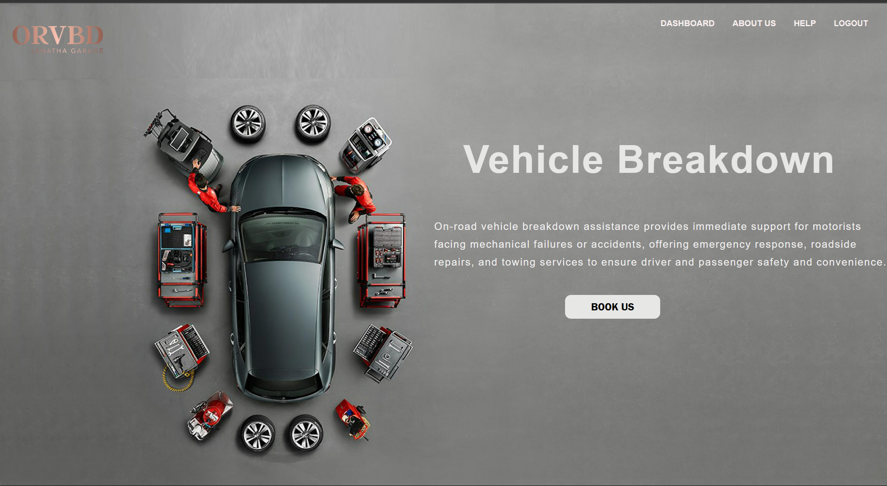
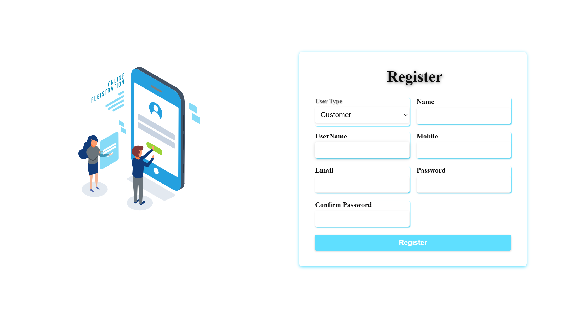
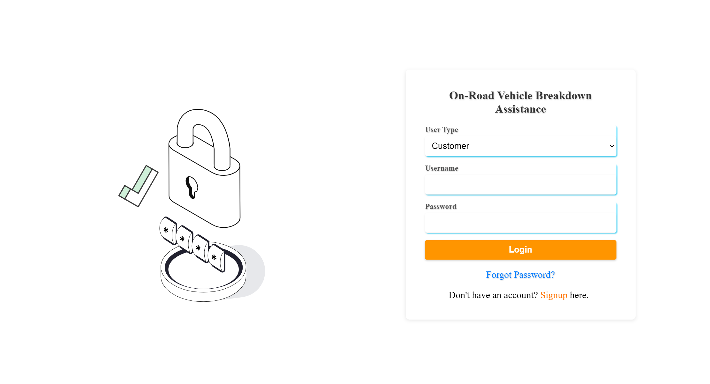

# On_Road_Vehicle_Breakdown_Assisstance








This MERN stack application helps users find mechanics near them when their vehicle breaks down. Users can book a mechanic, track the mechanic's location, and manage requests. Mechanics can toggle their availability and manage incoming service requests.


## Table of Contents

- [Features](#features)
- [Technologies Used](#technologies-used)
- [Installation](#installation)
- [Usage](#usage)
- [Project Structure](#project-structure)
- [Future Enhancements](#future-enhancements)
- [Contributing](#contributing)
- [License](#license)
- [Contact](#contact)

## Features

- **User Registration**: Users can register as a customer or a mechanic.
- **Mechanic Availability**: Mechanics can toggle their availability status.
- **Service Requests**: Customers can submit a request for vehicle assistance.
- **Real-time Tracking**: Customers can track the mechanic's location after booking.
- **Mechanic Dashboard**: Mechanics can view and manage new service requests.
- **Notifications**: SMS notifications for mechanics via Twilio (optional).
- **Responsive UI**: The app layout adjusts for different screen sizes.

## Technologies Used

- **Frontend**: React.js, 
- **Backend**: Node.js, Express.js
- **Database**: Mysql
- **Authentication**: JWT (JSON Web Token)
- **State Management**: React hooks
- **Styling**: CSS


## Usage

1. **Registration**: Customers and mechanics can register via the registration page.
2. **Login**: Log in to the platform to access the dashboard.
3. **Customer Features**: Customers can submit requests and track their mechanic.
4. **Mechanic Features**: Mechanics can toggle availability, receive requests, and manage them via their dashboard.


## Future Enhancements

- **Payment Integration**: Add payment gateways for customer convenience.
- **Real-Time Notifications**: Implement live notifications for both customers and mechanics.
- **Review System**: Allow customers to rate and review mechanics.
- **Push Notifications**: Add support for push notifications for mobile users.

## Contributing

Contributions are welcome! To contribute:

1. Fork the repository.
2. Create a new feature branch:
    ```bash
    git checkout -b feature-branch-name
    ```
3. Commit your changes:
    ```bash
    git commit -m "Add some feature"
    ```
4. Push to the branch:
    ```bash
    git push origin feature-branch-name
    ```
5. Open a pull request.

# OSM Backend (MySQL)
Run:
1) Create DB and tables: import `schema.sql`
2)  `.env` and fill values
3) `npm install`
4) `npm run dev`

The API matches the original endpoints used by the frontend:
- POST   /register
- POST   /login
- POST   /service-request
- PUT    /service-request/approve/:id   (JWT: Mechanic)
- PUT    /service-request/reject/:id    (JWT: Mechanic)
- GET    /service-requests/user/:userId (Public)  — kept for compatibility
- GET    /service-requests/user         (JWT: Customer)
- GET    /mechanic/details              (JWT: Mechanic)
- GET    /mechanic/status               (JWT: Mechanic)
- PUT    /mechanic/update-status        (JWT: Mechanic)
- GET    /user-info                     (JWT)
- PUT    /user/update/:id               (JWT: Customer)
- PUT    /mechanic/update/:id           (JWT: Mechanic)
- DELETE /delete-profile/:id            (JWT: Owner)
- POST   /forgot-password               (issue reset token; prints to server logs)
- POST   /reset-password                (reset via token)


